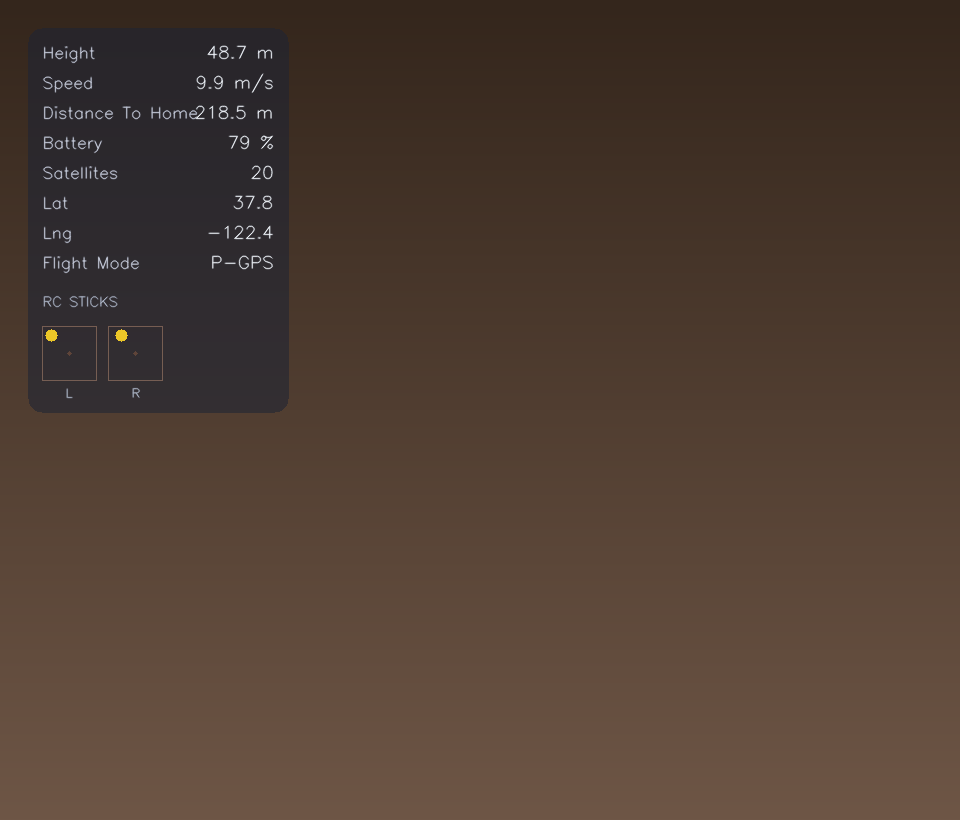
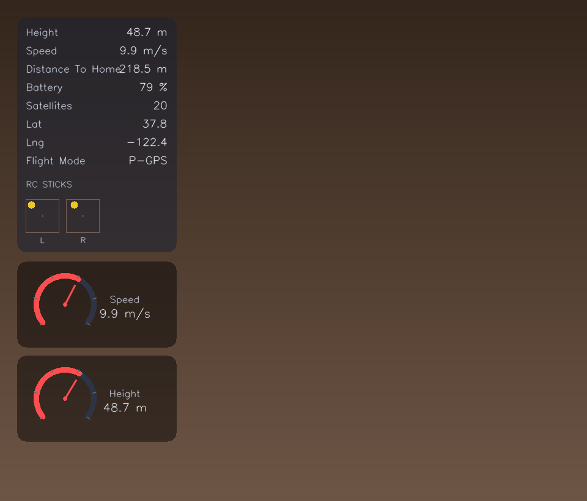

# Flightframe Telemetry Overlay

Flightframe turns drone telemetry into **cinematic overlays**: a translucent **metrics card**, optional **RC sticks**, and optional **dial gauges**—rendered to a transparent clip for your editor, plus optional **SRT** subtitles that match the overlay.

> [!IMPORTANT]
> *DJI is a registered trademark of SZ DJI Technology Co., Ltd. DroneLogbook® is a registered trademark of DroneAnalytics Inc. Litchi is a trademark of VC Technology Ltd. Airdata or Airdata UAV is a trademark of Airdata UAV, Inc. This project is independent and is not affiliated with, sponsored by, authorized by, or endorsed by SZ DJI Technology Co., Ltd., DroneAnalytics Inc., VC Technology Ltd., Airdata UAV, Inc., or their affiliates.*

## Preview

Synthetic telemetry composited on a dark background (your export uses transparency so you can composite over real footage).

| Telemetry card + RC sticks | Same layout **with dial gauges** |
| :---: | :---: |
|  |  |

Enable gauges in YAML with `gauges.enabled: true`. See [`examples/gauges.config.yaml`](examples/gauges.config.yaml) for a complete example.

## Features

- **Telemetry card** — Pick columns, labels, decimals, and `metric` / `imperial` / `auto` units.
- **Dial gauges** — Three semi-circular dials (speed, height, battery) with auto-scaled ranges from your flight data; customizable colors and placement (including auto-stacking below the card).
- **RC sticks** — Optional mini stick positions when your CSV includes RC channels.
- **Transparent `.mov`** — Alpha-friendly output (`png` or `qtrle` codec).
- **SRT export** — Optional subtitle track with the same selected fields.

## Why this stack

- **OpenCV** — Fast frame I/O and drawing for an offline CLI workflow on major OSes.
- **Polars** — Quick CSV loads for large telemetry files.
- **PyYAML** — Human-editable configs.
- **Typer** — Straightforward CLI.
- **NumPy** — Interpolating telemetry to video timestamps.

## Install

```bash
git clone https://github.com/DevinNorgarb/opendronelog-overlay.git
cd opendronelog-overlay
pip install -e .
```

## Run

Transparent alpha overlay (typical usage):

```bash
flightframe render \
  --input-csv ./csv/FlightRecord_2026-03-17_11-22-12_.csv \
  --config ./examples/overlay.config.yaml \
  --output-video ./out/overlay-alpha.mov \
  -v
```

Use [`examples/gauges.config.yaml`](examples/gauges.config.yaml) instead of `overlay.config.yaml` when you want dial gauges enabled.

Add SRT subtitles with the same telemetry selection:

```bash
flightframe render \
  --input-csv ./csv/FlightRecord_2026-03-17_11-22-12_.csv \
  --config ./examples/overlay.config.yaml \
  --output-video ./out/overlay-alpha.mov \
  --output-srt ./out/overlay-telemetry.srt \
  -v
```

### Alignment (telemetry offset)

If your CSV `time_s` is slightly ahead/behind the video, you can shift telemetry sampling with:

```bash
flightframe render \
  --input-csv ./csv/FlightRecord.csv \
  --config ./examples/overlay.config.yaml \
  --output-video ./out/overlay-alpha.mov \
  --telemetry-offset-s 1.25
```

Offset convention: the overlay samples telemetry at \(t_{telemetry} = t_{video} - \text{offset}\).

- If the overlay looks **late**, increase `--telemetry-offset-s`.
- If the overlay looks **early**, decrease it (or use a negative value).

### SRT-only export (no video rendering)

To export subtitles without creating a `.mov` overlay:

```bash
flightframe srt \
  --input-csv ./csv/FlightRecord.csv \
  --config ./examples/overlay.config.yaml \
  --output-srt ./out/overlay-telemetry.srt \
  --telemetry-offset-s 1.25
```

Extra logging (includes ffmpeg detail in transparent mode): pass `-vv` instead of `-v`.

**Progress bar:** on by default; disable with `--no-progress`, or pass `--progress` to force it on.

### Import DJI FlightRecord `.txt`

DJI “`.txt`” flight logs are a binary format. Convert them to a CSV that this tool can ingest:

```bash
flightframe import-dji \
  --input-txt "/path/to/DJIFlightRecord_2024-12-30_[21-34-15].txt" \
  --output-csv ./out/flight.csv \
  --output-airdata-csv ./out/flight.airdata.csv
```

This command shells out to `djirecord` (from `pydjirecord`). Install it via `pipx` to avoid dependency conflicts:

```bash
brew install pipx
pipx ensurepath
pipx install pydjirecord
```

## Configuration

Reference configs:

- [`examples/overlay.config.yaml`](examples/overlay.config.yaml) — Card, RC sticks, transparent output; gauges commented sample.
- [`examples/gauges.config.yaml`](examples/gauges.config.yaml) — Same with **`gauges.enabled: true`**.

Common options:

- `telemetry.include` — Fields on the card and in SRT.
- `telemetry.unit_system` — `auto`, `metric`, or `imperial`.
- `rc_sticks.enabled` — Mini joystick visualizer.
- `transparent_output.*` — Canvas size, FPS, padding, `png` / `qtrle` codec.
- `style.*_hex` — Panel and text colors (`panel_bg_hex`, `label_text_hex`, `value_text_hex`, `muted_text_hex`).

### Dial gauges

> [!NOTE]
> Gauges are **experimental** and **off** unless you set `gauges.enabled: true`.

When enabled, the renderer draws **speed**, **height**, and **battery** dials. Ranges scale from your telemetry (with sensible fallbacks). Placement: set `gauges.x` to `-1` to auto-stack full-width rows under the text panel (default), or use non-negative `gauges.x` / `gauges.y` with `gauges.layout` `horizontal` or `vertical`.

If a gauge row lands below the frame, it is skipped—increase `transparent_output.height`, reduce `gauges.height` / `gauges.gap`, or turn off `rc_sticks` when you need more room for stacked dials.

| Key | Purpose |
| --- | --- |
| `gauges.enabled` | Turn gauge rendering on or off (default `false`). |
| `gauges.layout` | `horizontal` or `vertical` (for manual `x`/`y` placement). |
| `gauges.width` / `gauges.height` | Dial size in pixels (default height `140`; width ignored in auto placement). |
| `gauges.x` | Horizontal offset; **`-1`** = auto placement below the card. |
| `gauges.y` | Vertical offset when `gauges.x >= 0`. |
| `gauges.gap` | Space between dials. |
| `gauges.*_color_hex` | `arc`, `needle`, `tick`, `label`, and `value` colors. |

Telemetry keys supported elsewhere in the overlay (card/SRT) include: `height`, `speed`, `distance_to_home`, `battery`, `satellites`, `lat`, `lng`, `flight_mode`, `altitude`, `battery_voltage`, `battery_temp`.

## AirData CSV conversion

Some tools only accept AirData-style CSV. For OpenDroneLog exports you can convert using:

- Web: https://open-dronelog.streamlit.app/
- Local script: `flightframe/ODL_2_AD.py`

```bash
python ./flightframe/ODL_2_AD.py ./input_odl.csv ./output_airdata.csv
```

## Notes

- CSV `time_s` is assumed to start near `0` and follow the video timeline.
- Transparent output uses `.mov` with alpha (`png` codec by default, or `qtrle`).
- `--output-srt` emits cues every second and merges consecutive identical lines.
